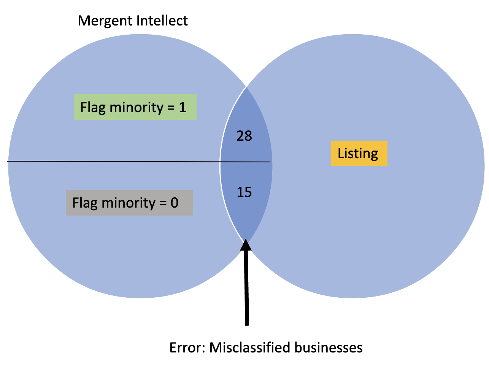

The term ‘In-Listing’ is used as a proxy for ‘minority-owned’ to reduce bias. This bias could exist because although we have high confidence that businesses in the Listing are minority-owned, we do not have confidence that businesses not in the Listing are not minority-owned. 

To reduce the bias that exists in the 'non-Listing' companies, we compiled a list of businesses founded before 1964. This is because the Civil Rights Act was implemented in 1964; businesses established before this date are more likely to be non-minority owned. According to [Census Data](https://storymaps.arcgis.com/stories/f74a8fbad837435b8e901cc9c04aa345), the population of non-minorities in Fairfax County in 1964 was approximately 90%, as opposed to around 50% in 2017. After finding the unique businesses labelled as ‘In-Listing,’ we extracted the same number of businesses classified as ‘non-Listing.’   

The way our training set was created is shown below. 

Using this method once again limited our training set. The number of businesses reported by Mergent Intellect with founding years prior to 1964 were only 108. Because the training set has to be entirely balanced (50% minority and 50% non minorities), we could only use a random set of 108 names from the minority business owners as well. 

This indicates a relatively small training set, and as mentioned before the only way to improve this dataset is by increasing the size of the data gathered. 

Using 1964 as a benchmark means we are using an exogenous event in the world to find a benchmark. This resulted in a smaller dataset. If we were to use a benchmark that is endogenous to our dataset we would use the year 1990 as a benchmark because as seen in our dataset there is a large jump in the number of businesses reported that year. If we were to use that year, then we could have a much larger datset. Doing this is a further application of our research and would be interesting to explore. 

{width=80% }

Our goal is to reduce the underrepresentation that Mergent Intellect is making in missclassifying minority owned businesses. This underrepresentation is identified as ‘error’ and represents the proportion of businesses that were falsely classified as non-minority owned. A visualization of this error rate is depicted below. 

The error rate of Mergent was approximately 39%, and the number of businesses correctly classified as minority-owned was around 7%.

