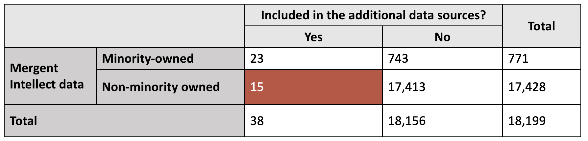
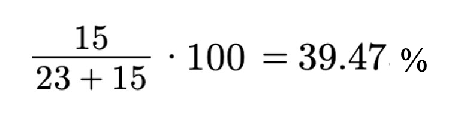

During our data discovery phase, we found business data from the minority-focused [Chamber of Commerce](https://novachamber.org/) websites ([Black](https://www.northernvirginiabcc.org/), [Hispanic](https://www.novahispanicchamber.com/), [Asian](https://www.aabac.org/), and [Native American](https://iaicc.org/)), [Yelp](https://www.yelp.com/search?find_desc=&find_loc=Fairfax%2C+VA), [Small Business Supply Directory (SBSD)](https://www.virginia.gov/agencies/department-of-small-business-and-supplier-diversity/), and the [Data Axle](https://www.data-axle.com/). 

The data from the minority-focused Chamber of Commerce sites and Yelp.com were found using web scraping.

**What is Web-Scrapping?**  Web scraping is a data extraction technique used to gather information from various websites on the internet. It involves automating the process of retrieving and parsing data from web pages, enabling the collection of large datasets quickly and efficiently.

The number of businesses found in each listing is as follows below. 

{width=70%}

These company names were added to our 'Listing'. The Listing refers to a list of businesses that we have high confidence are minority owned. 

Another dataset that was added to our Listing was the businesses that had been flagged by Mergent Intellect. 

{width=80%}

This table demonstrates that although the Mergent Intellect dataset may appear large at first, when we found only the businesses that had executive names reported, the number decreased vastly, and after finding those owner name's that also had a minority flag, the number became even smaller, only 743 businesses. 

The data from the listing had to be cross referenced with 743 companies from Mergent that were minority flagged and had executive names reported to find the places where those had overlapped. 

We used fuzzy matching to cross reference the company names in Mergent intellect and the companies. 

**What is Fuzzy Matching?**  Fuzzy matching is a data analysis technique used to compare and match two names with slight differences or variations. Unlike exact matching, fuzzy matching allows for flexible comparisons, considering typographical errors and abbreviations. By applying string similarity metrics, fuzzy matching identifies potential matches and enhances data accuracy, data integrity, consistency, and reliability in research outcomes.

Overall, the number of businesses found in the listing and the Mergent minority flag was approximately 70. This clearly is a very small number compared to what we began with. The only way to mitigate this issue is to continue web scrapping and develop our listing size to be greater. 

##**Mergent Intellect's Missclassification** 

As mentioned before, the issue with the Mergent Intellect data is that it underrepresents the number of minority businesses. This is also evident because a certain number of businesses in Mergent Intellect have been missclassified. We know this because these businesses have been found in the additional data sources. The table below represents this misclassification. 

{width=80%} {width=30%}

The percentage of businesses that were missclassified in the Mergent Intellect data is 39.47%. 

