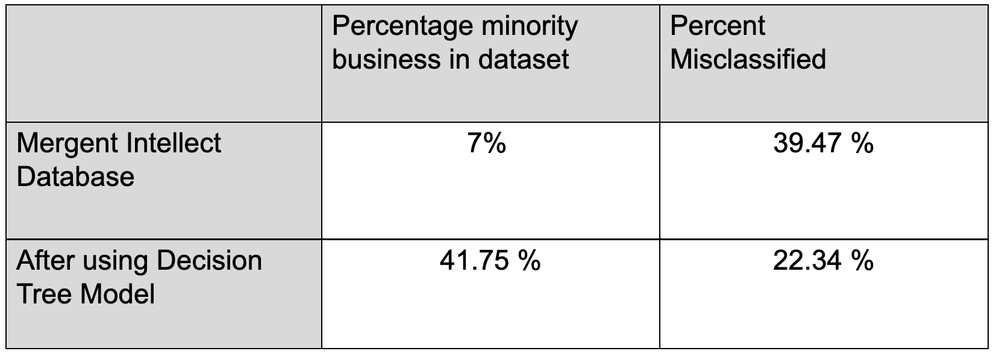
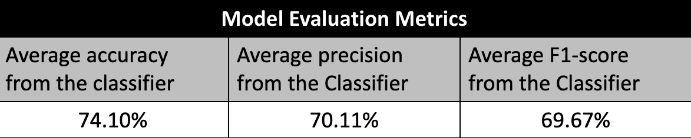

We created a decision tree classification model to identify Mergent Intellect’s underrepresentation of minority owned businesses. 

A decision tree is a type of supervised machine learning used to categorize or make predictions based on how a previous set of questions were answered.The decision tree classifier specific to our model is shown below. 
{width=80% }

##**Assessing the Missclassification** 

The error rate of Mergent was approximately 39%, and the number of businesses correctly classified as minority-owned was around 7%. We applied it to the totality of the Mergent Intellect dataset and determined that the reported error value decreased. As our focus is identifying misclassified businesses, we only applied the model to those that were not already flagged as minority owned by Mergent. We proceeded by applying the model to the non-flagged businesses and then included the businesses that were correctly listed as minority owned. By doing this, we calculated the new percentage of minority-owned businesses, which turned out to be 41.75%. Next, we assessed the error of this updated model and found it to be 22.34%, significantly lower than the initial error rate. This result indicates that our model is performing well and reducing the error in tracking minority business ownership. 

Note that although we are benchmarking our results with the 2017 Census, which reported 38% minority business ownership in Fairfax County, because this model is being applied to recent data, having a higher percentage of minority owned businesses is extremely plausible. 

The percentages represented above are depicted in the table below for clarity.

{width=80% }

##**Evaluating the Model** 

Because our training and testing sample was small (only 138 businesses), the model was trained and evaluated 10,000 times. For each sample of 138 companies, we split it into a training (70%) and a test (30%) sample.

After training our model, we then evaluated it’s performance of our model in classifying businesses as minority-owned or not using our testing sample.

We computed the averages of the measures presented in the figure shown below:

{width=80%}

  

**How the minority-ownership flagging works** 

-If a company is identified as minority by Mergent, we report the minority status from Mergent Intellect

-If a company is listed as non-minority owned by Mergent, we report the flag from the classifier

## **GIS Map**

Using the decision tree classifier model, a GIS map of Fairfax County was created. This map represents the percentage of minority-owned business per census tract. The two maps represent the number of minority owned businesses according to the Mergent Intellect database before and after the model was applied. By looking at these GIS maps, one can visualize how minority businesses are distributed across Fairfax County. 

These maps are not representative of all of Fairfax County because we were only able to apply the model to the 18k businesses that had executive names reported. This means that several tracts could be underrepresented. 

{width=40% }
{width=40% }

