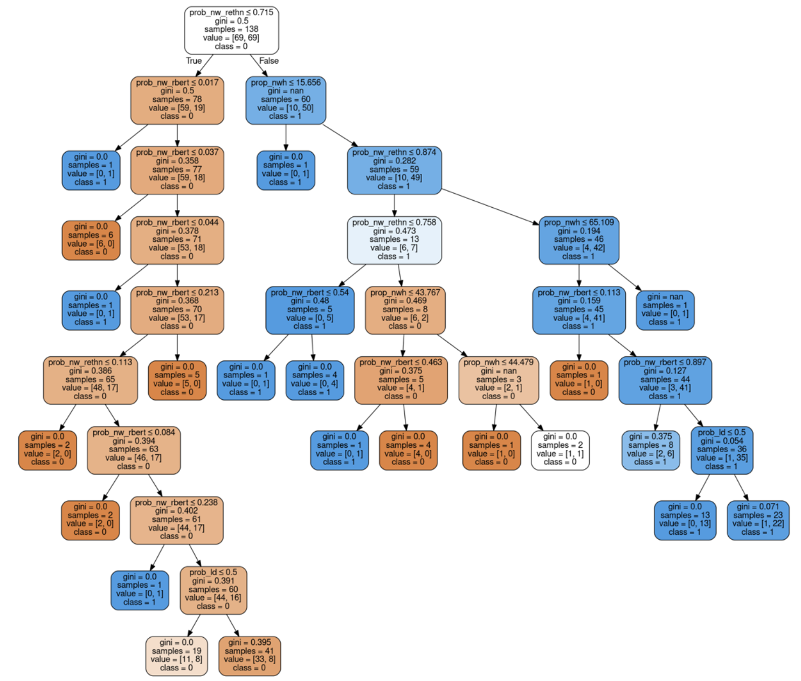
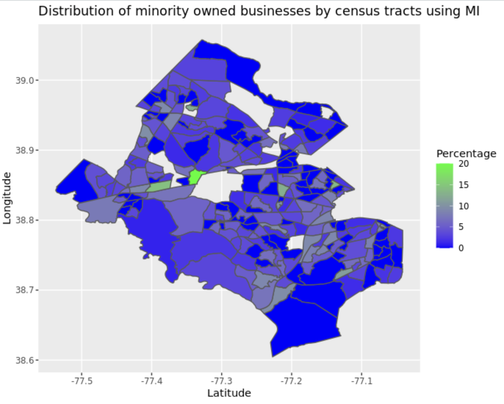
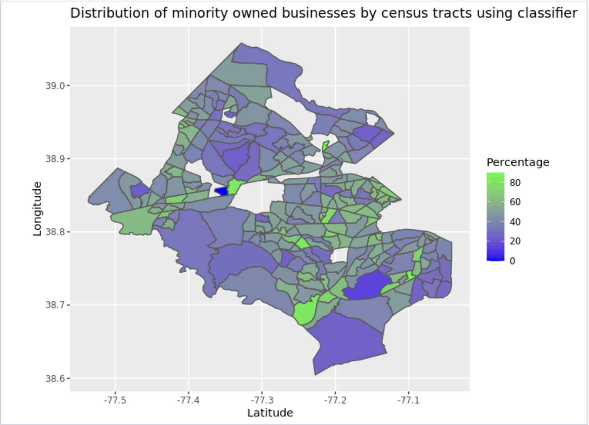

We then created the decision tree classification model to identify Mergent Intellect’s underrepresentation of minority owned businesses. 

A decision tree is a type of supervised machine learning used to categorize or make predictions based on how a previous set of questions were answered.The decision tree classifier specific to our model is shown below. 
{width=80% }

The error rate of Mergent was approximately 39%, and the number of businesses correctly classified as minority-owned was around 7%. We applied it to the totality of the Mergent Intellect dataset and determined that the reported error value decreased. As our focus is identifying misclassified businesses, we only applied the model to those that were not already flagged as minority owned by Mergent. We proceeded by applying the model to the non-flagged businesses and then included the businesses that were correctly listed as minority owned. By doing this, we calculated the new percentage of minority-owned businesses, which turned out to be 37.77%. Remarkably, this figure closely aligned with the 38% reported by the ABS census, which was our target percentage. Next, we assessed the error of this updated model and found it to be 26.315%, significantly lower than the initial error rate. This result indicates that our model is performing well and reducing the error in tracking minority business ownership. 

The percentages represented above are depicted in the table below for clarity.  
{width=80% }

## **GIS Map**

Using the decision tree classifier model, a GIS map of Fairfax County was created. This map represents the percentage of minority-owned business per census tract. The two maps represent the number of minority owned businesses according to the Mergent Intellect database before and after the model was applied. By looking at these GIS maps, one can visualize how minority businesses are distributed across Fairfax County. 

{width=40% }
{width=40% }

