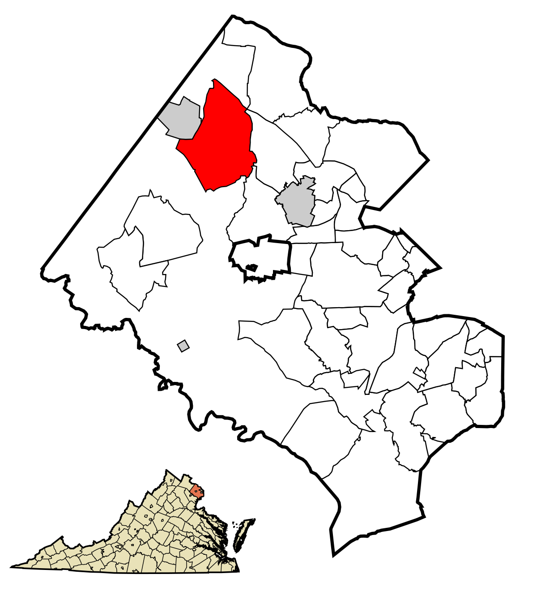
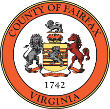

<!DOCTYPE html>
<html>
<head>

</head>
<body>
</head>
<body>

<!-- Table of Contents -->

  <h2>Table of Contents</h2>
  <ul>
[Project Background](#project-background)
[Research Questions](#research-questions)
[Project Goals](#project-goals)
[Summary of Findings](#summary-of-findings)
[Sponsor and Stakeholders](#sponsor-and-stakeholders)
[Sources](#sources)

  </ul>

</body>
</html>

### **Project Background** 
The Business Diversity project is a significant part of the [Social and Impact Data Commons](https://biocomplexity.virginia.edu/project/social-impact-data-commons) project. The Data Commons is an open knowledge repository that compiles data from trusted open access sources to provide tools designed to track issues over time and geographical locations. Our project aims to help policy makers and outreach programs track economic diversity—focusing on minority-owned businesses—within [Fairfax County, Virginia](https://www.fairfaxcounty.gov/topics/about-fairfax-county).

**How is a minority-owned business defined?**  A minority-owned business is a US-based enterprise predominantly owned (51% or more) by one or more members of a socially and economically disadvantaged minority group based on race.

{width=50%}

  
  Microdata enables the study of minority-owned business activities at small geography levels. Current business microdata sources do not adequately identify minority-owned businesses. A case study conducted in Fairfax County revealed that the [Annual Business Survey (ABS)](https://www.census.gov/programs-surveys/abs/about.html#:~:text=The%20Annual%20Business%20Survey%20(ABS)%20provides%20information%20on%20selected%20economic,%2C%20race%2C%20and%20veteran%20status). reported approximately 38% of minority-owned businesses in 2017. During that same period, [Mergent Intellect](https://www.epls.org/340/Mergent-Intellect#:~:text=Mergent%20Intellect%20is%20a%20flexible,to%20generate%20insightful%20business%20intelligence)., our primary datasource,  reported only 7%. Although we do not have Mergent Intellect’s methodology for identifying minority-owned businesses, our preliminary findings suggest that Mergent Intellect includes solely registered minority-owned businesses, underrepresenting those not registered. The inconsistency across these sources leads us to ask these questions
  
**Research Questions**

- How are minority-owned businesses distributed across Fairfax County geographically?
- How are minority-owned businesses distributed across Fairfax County by business type and by industry?

The map to the left represents how Fairfax County is split into census tracts. 

### **Project Goals**
To help answer these research questions, our goal was to create a binary classification model that can reduce the error in predicting and tracking minority business ownership in Fairfax County, thus, accounting for the underrepresentation in Mergent Intellect’s data. Our classification model consists of three inputs:

- The Business Owner’s Name
- The Company’s Name
- The Company’s Location

We also kept ethical considerations in mind, which is why we decided to employ a binary [classification model](https://medium.com/fuzz/machine-learning-classification-models-3040f71e2529), and not disclose any business owner's racial identifiers.  

### **Summary of Findings**
We applied our final classification model to the non-flagged businesses, including the businesses that were correctly listed as minority owned. By doing this, we increased the reported percentage of minority-owned businesses for Mergent Intellect, to 48.27%.  We also reduced the error of misclassified businesses by Mergent Intellect by 12%. 

### **Sponsor and Stakeholders** 

{width=60% }

This project is sponsored by the [Mastercard Center for Inclusive Growth](https://www.mastercardcenter.org/) and the stakeholders are the [Fairfax County Government Economic Development Authority](https://www.fairfaxcountyeda.org/). This is one portion of the greater Data Commons project which aims to build an open knowledge repository. 

### **Sources** 

These are our sources

