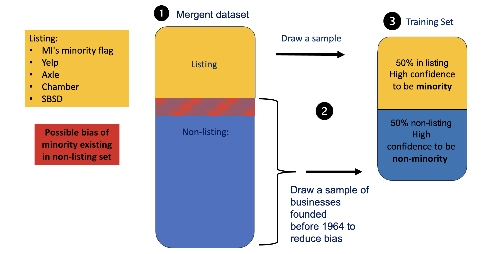
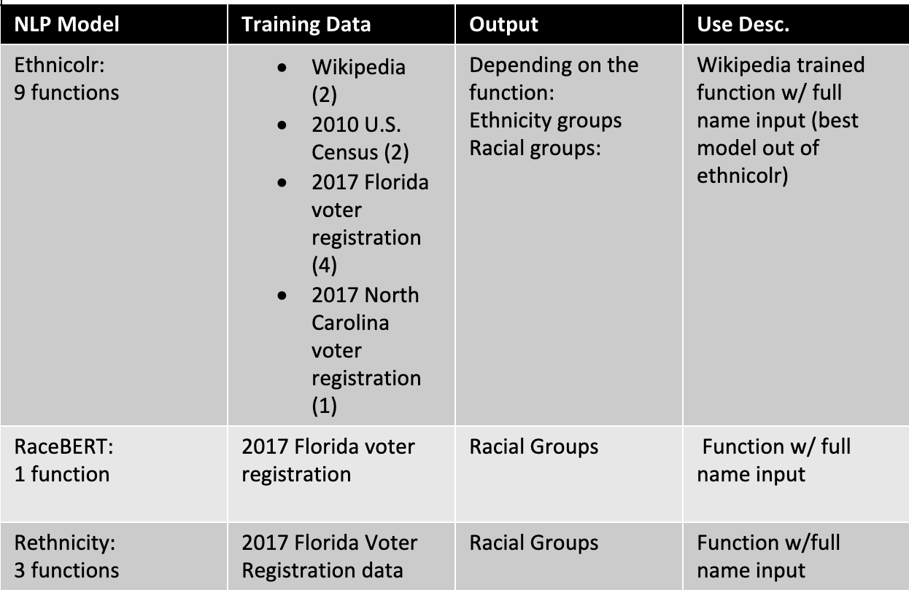
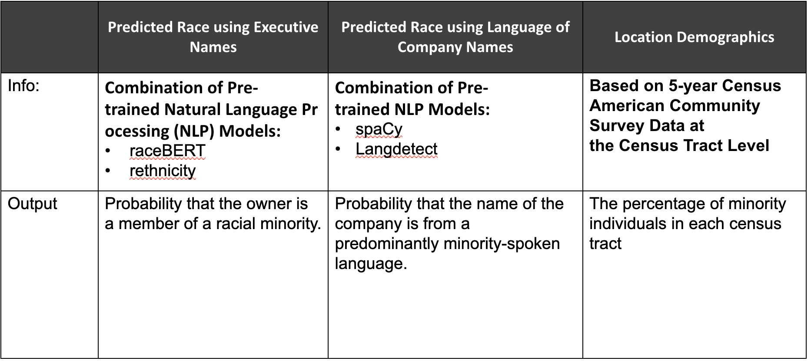

### Comparing Our Sources
After our data discovery phase, we overlapped Mergent Intellect businesses and our business listing to verify our main hypothesis that Mergent Intellect has flagged some companies as non-minority owned while they have been reported from outside sources as minority owned. Therefore, we obtained a rough estimate of the underrepresentation made by Mergent Intellect in flagging minority-owned businesses and non-minority owned businesses.

### Building our Training and Testing Set
Second, we built our balanced training sample for modeling by sub-setting crossrefrenced Mergent Intellect businesses with a list of businesses for which we have high confidence in the classification as minority or not depending on whether they are listed as such in the outside sources found in our Data Discovery phase.
The term ‘Listed’ and ‘Not Listed’ is used as a proxy for minority owned and non-minority owned respectively inorder to reduce bias. This bias could exist because although we have high confidence that businesses in the Listing are minority-owned, we do not have confidence that businesses not in the Listing are not minority-owned.
We the Proceeded to Build our training and testing sample with these two steps:
1. We sampled the businesses among those reported by Mergent as minority owned that were crossrefrenced with businesses listed in our outside sources. Given both the report of Mergent Intellect’s minority-owned tag and the tag of our outside source, we have confidence about this sample being comprised of minority owned businesses.
2.  Because the list of non-minority owned businesses reported by Mergent Intellect contains both minority and non-minority-owned businesses, we can’t use a sample of that list to identify non-minority owned businesses. We propose to use the founding year as a filter to identify non-minority owned businesses. The intuition of this filter consists of saying that before the Civil Rights Act of 1964, which prohibits discrimination based on race, color, religion, sex or national origin, only a few minority businesses existed. Therefore, businesses founded before 1964 are more likely to be non-minority owned. [source here containing info to back this up] (Note: This filtering doesn’t exactly identify non-minority owned businesses but reduces the error from sampling non-minority which are effectively minority-owned businesses. In addition, this approach introduces additional assumptions such as the owner has remained the same since the foundation. Our final sample comprises 216 businesses. we compiled a list of businesses founded before 1964. This is because the Civil Rights Act was implemented in 1964; businesses established before this date are more likely to be non-minority owned. According to [Census Data](https://storymaps.arcgis.com/stories/f74a8fbad837435b8e901cc9c04aa345), the population of non-minorities in Fairfax County in 1964 was approximately 90%, as opposed to around 50% in 2017. After finding the unique businesses labelled as ‘Listed’, we extracted the same number of businesses classified as ‘Not Listed.’
The way our training set was created is shown below.

### Buidling Our Model
  For ethical purposes, our model employs the binary classification of minority owned or non-minority owned among businesses. Business executives’ racial identifiers are not disclosed to maintain this research’s intended application.We look at business executive names as our first predictor, existing research on name analysis suggests that names with distinct cultural or ethnic backgrounds are often associated with minority individuals. As our second predictor, we chose to evaluate the language that a company’s name is written in as another helpful indicator of the company owner’s minority status. Lastly, our third predictor is the population demographics at the business’ locations.
  
## Predicting Race using Executives’ Names
  The business executive names included in our training set were evaluated using natural language processing methods. We tested among three pre-trained NLP software packages: RaceBERT, rethnicity, Ethnicolr. Each package contains tools to make predictions, given a first and/or last name. These packages use various data sources such as Wikipedia, the U.S Census, and the Florida and North Carolina voter registration database from early 2017. For the tools we applied within our first predictor, each outputs a data frame containing the probabilities that an individual would belong to a specific racial or ethnic group given both a first and last name.
{width=80%}
   To promote binary classification, we simply started by applying the complementary rule to the probability of an individual being white to compute the probability that they are non-white for each name, aggregating this into two columns. Next, we created a prediction column that flags each name possessing a higher probability of being non-white (greater than 0.5) to belong to a member of a minority group. A value of 1 means an owner is predicted to be a minority and 0 if otherwise.
To visualize the distribution and confirm the accuracy of RaceBERT’s (Figure 5) and rethnnicity’s (Figure 6) predictions, a box plot was constructed. The box plot presents the probability scores of names classified as minority (1) and those classified as non-minorities (0). This analysis aimed to ensure that names labeled as minority businesses consistently exhibited high probabilities, and that the average probability for minority names was higher than that for non-minority names.
[Figure 5](img/raceB_box.png)
[Figure 6](img/rethn_box.png)

## Company Name:
   We assessed the languages of the company names in our training set using natural language processing. We created a list of non-minorities spoken languages like English, French, German, etc. and identified companies where the name’s language is spoken by a minority group, including Spanish, Arabic, Hindi, etc. To achieve this, we employed three software tools that utilize sources like Google translate to predict the probability of a name in English phonetically resembling a different language. Next, in coherence with the output manipulation of the NLP the same method for assigning each value a binary indicator of 1 (minority) and 0 (non-minority) was utilized as mentioned in the paragraph above.
 boxplot
 
## Company Location:
   The final predictor of our model will factor in the population demographics of Fairfax County. Utilizing 2021 American Community Survey census data, we subdivided Fairfax County demographic by its 233 identifiable census tracts. Census tracts are subdivisions of counties containing approximately 4,000 people. We chose tracts as our geography level because they are stable over time, allowing for comparisons over periods of time. To allow us to weigh in the factor of demographic composition in our analysis, we used geolocation to locate the census tracts of each business given their address. By factoring in our final predictor of location demographics, we can provide a more accurate prediction of business diversity in the Fairfax County area.

### Model Evaluation
Because our training an testing sample was small (216 businesses), the model was trained and evaluated 10,000 times. For each sample of 216 companies, we split into a training (70%) and a test (30%) sample.
After training our model, we then evaluated it’s performance of our model in classifying businesses as minority-owned or not using our testing sample.
A confusion matrix can evaluate the performance of classification arguments. A true positive (TP) represents the number of properly classified abstracts as big data. A true negative (TN) represents the number of correctly classified abstracts that are not related to big data. A false positive (FP) represents the number of misclassified documents as being big data that are actually not related to big data. Finally, a false negative (FN) represents the number of abstracts misclassified as not being related to big data when it is about big data.
[Figure 7: insert image here of matrix]
We can use these metrics to calculate our model’s accuracy, precision, recall, and F1 score, whose calculations are shown in the graphic below.
[Figure 8: insert image  of equations here]
We computed the averages of the measures presented in Figur 8 shown below:
[Figure 9: metric table]

### Model Application
We predicted the minority status of businesses reported in the overlap of Mergent Intellect and the listing. Therefore, we estimate the proportion of businesses flagged as non-minority by Mergent Intellect, for which both the model and outside sources flagged as minority owned. This process allows us to estimate how the model has reduced the error made by Mergent Intellect in flagging minority-owned businesses and non-minority owned businesses.
Note:
If a company is identified as minority by Mergent, we report the minority status from Mergent Intellect,
If a company is listed as non-minority owned by Mergent, we report the flag from the classifier
Finally, after applying our model on the businesses from Mergent Intellect we compared the percentage of minority-owned businesses with the ABS (Annual Business Survey), a source that our stakeholders want as a benchmark. (Note: We understand with only access to 2017 ABS data the percentage of minority-owned businesses would have changed as we are using data in the research past this timeline)
 
