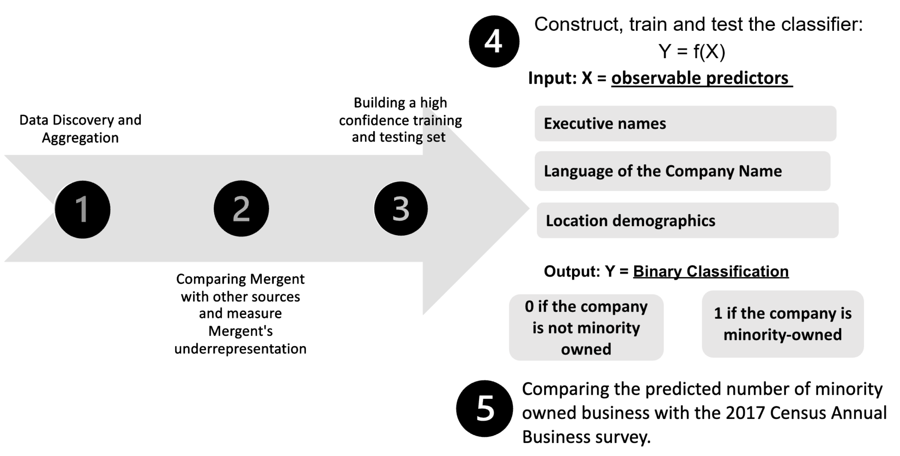

## Phase 1

Data Discovery and Aggregation

Our Data Discovery and Aggregation phase involved compiling a set of data sources which we have high confidence that the businesses are truly minority-owned.

The main dataset we are exploring is called Mergent Intellect, which is a large dataset that has been aggregated by many different sources. This is an expansive dataset, but they have underrepresented the number of minority-owned businesses in Fairfax County.

## Phase 2

Comparing Our Sources

After our data discovery phase, we overlapped Mergent Intellect businesses and our additional verification sources to verify our main hypothesis that Mergent Intellect has flagged some companies as non-minority owned while they have been reported from outside sources as minority owned. Therefore, we obtained a rough estimate of the underrepresentation made by Mergent Intellect in flagging minority-owned businesses and non-minority owned businesses.

## Phase 3

Building our Training and Testing Set

We built our balanced training sample for modeling by sub-setting crossrefrenced Mergent Intellect businesses with a list of businesses for which we have high confidence in the minority classification (depending on whether they are listed as such in the outside sources found in our Data Discovery phase).

The term ‘Listed’ and ‘Not Listed’ is used as a proxy for minority owned and non-minority owned respectively in order to reduce bias. **This bias could exist because although we have high confidence that Listed businesses are minority-owned, we do not have confidence that businesses Not-Listed are not minority-owned**.

We the Ppoceeded to build our training and testing sample with these two steps:

1. We sampled the businesses among those reported as minority owned by Mergent Intellect that were crossrefrenced with businesses listed in our outside sources. Given both the report of Mergent Intellect’s minority-owned tag and the tag of our outside source, **we have confidence about this set being comprised of minority owned businesses**.

2.  Because the list of non-minority owned businesses reported by Mergent Intellect contains both minority and non-minority-owned businesses, we can’t use a sample of that list to identify non-minority owned businesses, as this would be a source of bias. 

We used the founding year as a filter to identify non-minority owned businesses. We only selected businesses that were founded prior to 1964 because they are more likely to be non-minority owned. 

**Why is the year 1964 selected as the cutoff?**  Because prior to the [Civil Rights Act of 1964](https://www.dol.gov/agencies/oasam/civil-rights-center/statutes/civil-rights-act-of-1964) (which prohibits discrimination based on race, color, religion, sex or national origin) only a few minority businesses existed. Also, According to [Census Data](https://storymaps.arcgis.com/stories/f74a8fbad837435b8e901cc9c04aa345), the population of non-minorities in Fairfax County in 1964 was approximately 90%, as opposed to around 50% in 2017.

This is not a perfect solution. It does not entirely remove the bias, it only lessens it. It also introduces another possible source of bias, which is the possibility of the owner changing. 

Our final sample comprises 138 businesses. After finding the unique businesses labelled as ‘Not Listed’, we extracted the same number of businesses classified as ‘Listed’ by randomly sampling from the subset of 813 companies. 

A visualization of the way our training set was created is shown below.

## Phase 4

4.1 Introducing Our Predictors

  For ethical purposes, our model employs the binary classification of minority owned or non-minority owned among businesses. Business executives’ racial identifiers are not disclosed to maintain this research’s intended application. 
  
  

**What are the predictors for our model?** 

1. Business executive names

2. The language that a company’s name is written

3. The proportion of non-minority individuals at the business's location

  

  
{width=80%}
  
  

  
  

4.1.1 Predicting Race Using Executive's Names

  We decided to use business' executives names as our first predictor because existing research on name analysis suggests that names with distinct cultural or ethnic backgrounds are often associated with minority individuals. The business executive names included in our training set were evaluated using natural language processing (NLP) methods. We tested out three pre-trained NLP software packages: RaceBERT, rethnicity, Ethnicolr. Each package contains tools to make predictions, given a first and/or last name. These packages use various data sources such as Wikipedia, the U.S Census, and the Florida and North Carolina voter registration database from early 2017. We found that out of the models we found, RaceBERT and rethnicity were the most efficient. We then applied these tools as our first predictor, where each tool outputs a data frame containing the probabilities that an individual would belong to a specific racial or ethnic group given both a first and last name.

{width=80%}
   
   
   
   To promote binary classification, we applied the [complementary rule](https://flexbooks.ck12.org/cbook/ck-12-middle-school-math-concepts-grade-7/section/12.6/related/lesson/complement-rule-for-probability-adv-pst/#:~:text=The%20Complement%20Rule%20states%20that,P%20(%20A%20%E2%80%B2%20)%20%3D%201) to the probability of an individual being white to compute the probability that they are non-white for each name, aggregating this into two columns. Next, we created a prediction column that flags each name possessing a higher probability of being non-white (greater than 0.5) to belong to a member of a minority group. A value of 1 means an owner is predicted to be a minority and 0 if otherwise.
   
   
To visualize the distribution and confirm the accuracy of RaceBERT’s (Figure 6) and rethnnicity’s (Figure 7) predictions, a box plot was constructed. The box plot presents the probability scores of names classified as minority (1) and those classified as non-minorities (0). This analysis aimed to ensure that names labeled as minority businesses consistently exhibited high probabilities, and that the average probability for minority names was higher than that for non-minority names.

{width=40%} {width=40%}

  

  

 4.1.2 Company Name

   We assessed the languages of the company names in our training set using natural language processing because names that phoentically sound like a minority-spoken language have a higher likelihood of belonging to a minority-owner. We created a list of non-minorities spoken languages like English, French, German, etc. and identified companies where the name’s language is spoken by a minority group, including Spanish, Arabic, Hindi, etc. To achieve this, we employed two software tools that utilize sources like Google translate to predict the probability of a name in English phonetically resembling a different language. These tools were LangDetect (Figure 8) and SpaceY (Figure 9) Next, the same method for assigning each value a binary indicator of 1 (minority) and 0 (non-minority) was utilized as mentioned in the paragraph above.

{width=40%} {width=40%}

  

4.1.2 Company Location

   The final predictor of our model will factor in the population demographics of Fairfax County. Utilizing 2021 American Community Survey census data, we subdivided Fairfax County demographic by its 233 identifiable census tracts. Census tracts are subdivisions of counties containing approximately 4,000 people. We chose tracts as our geography level because they are stable over time, allowing for comparisons over periods of time. To allow us to weigh in the factor of demographic composition in our analysis, we used geolocation to locate the census tracts of each business given their address. We found the proportion of nonwhite individuals at each specific census tract that the business owner resides in.

  

4.2 Model Evaluation

Our training set was split up, and 30% of it was subsetted into the testing set. The model was run 10,000 times to produce evaluation metrics of the model. 

A confusion matrix can evaluate the performance of classification arguments. A true positive (TP) represents the number of properly classified abstracts as big data. A true negative (TN) represents the number of correctly classified abstracts that are not related to big data. A false positive (FP) represents the number of misclassified documents as being big data that are actually not related to big data. Finally, a false negative (FN) represents the number of abstracts misclassified as not being related to big data when it is about big data.

](img/confusionmatrix.png){width=80%}

We can use these metrics to calculate our model’s accuracy, precision, recall, and F1 score, whose calculations are shown in the graphic below.

](img/metricformulas.png){width=80%}

  

4.3 Model Application

We predicted the minority status of businesses reported in the overlap of Mergent Intellect and the listing. Therefore, we estimate the proportion of businesses flagged as non-minority by Mergent Intellect, for which both the model and outside sources flagged as minority owned. This process allows us to estimate how the model has reduced the error made by Mergent Intellect in flagging minority-owned businesses and non-minority owned businesses.

## Phase 5

Comparing Results

Finally, after applying our model on the businesses from Mergent Intellect we compared the percentage of minority-owned businesses with the ABS (Annual Business Survey), a source that our stakeholders want as a benchmark. (Note: We understand with only access to 2017 ABS data the percentage of minority-owned businesses would have changed as we are using data in the research past this timeline)
 

