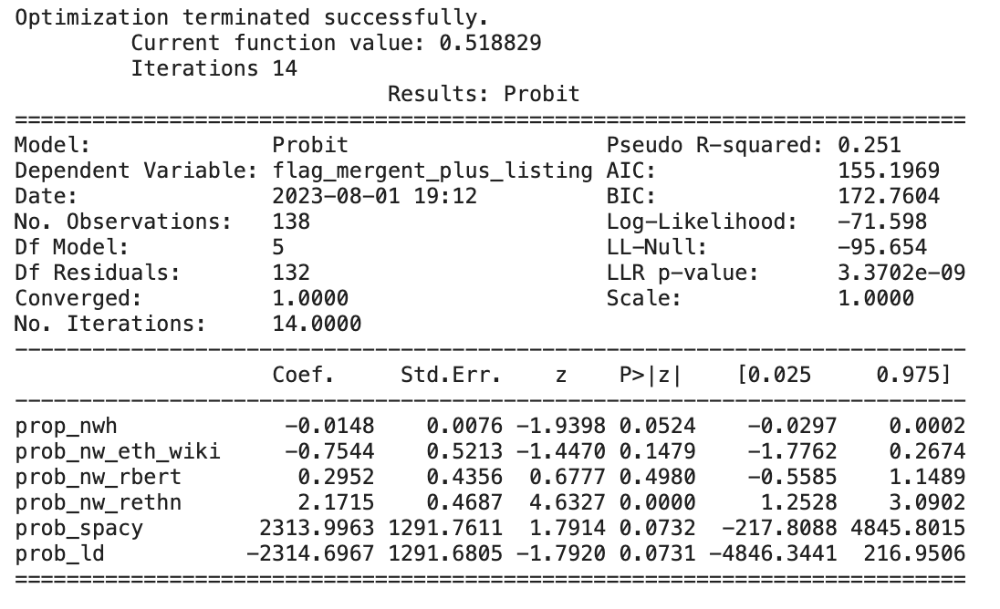
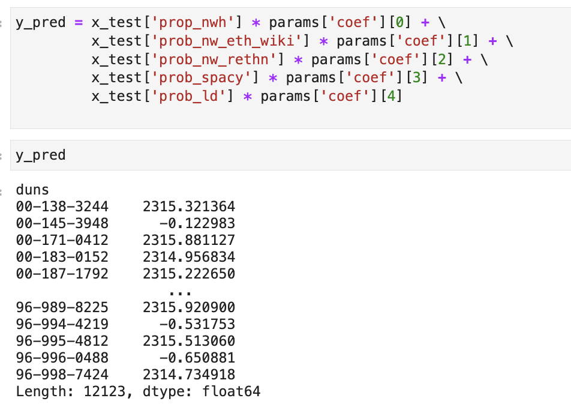

## Probit Model
The probit model is a type of statistical model used in binary classification tasks, where the outcome variable can take one of two possible values (usually coded as 0 and 1). The primary purpose of the probit model is to estimate the probability that the binary outcome occurs as a function of one or more predi
ctor variables. Instead of modeling the probability directly using a linear relationship as in the logistic regression, the probit model uses the cumulative standard normal distribution (also known as the probit function) to transform the linear predictor into probabilities. The model assumes that the error ter
m follows a standard normal distribution, and through the probit function, the predicted probabilities can be linked to the predictors. This makes the probit model useful in situations where the underlying relationship between predictors and probabilities may not be linear. The model is estimated using maximum 
likelihood estimation, and the coefficients obtained from the estimation provide insights into the impact of predictor variables on the binary outcome's probability.
We then created the decision tree classification model to identify Mergent Intellect’s underrepresentation of minority owned businesses. 
We used several packages to estimate each predictors. For predicting the ethnicity via name, we used the ethnicolr, racebert, and rethnicity packages and for the second predictor i.e., predicting the language of the company name, we used spacy and langdetect. The third predictor was the percentage of non-minori
ties in the tract area where the company is located. The results of the training the data on the probit model is as follows:-

{width=80% }

From the image above, we can interpret that the significance of the coefficients is determined by their p-values. In this model, "prob_nw_rethn" has a p-value of 0.0000, which means it is highly statistically significant. On the other hand, "prob_nw_eth_wiki," "prob_nw_rbert," "prob_spacy," and "prob_ld" have p -values greater than 0.05, suggesting that these coefficients are not statistically significant at the 5% level.

The model converged successfully, which means the estimation algorithm was able to find a solution that maximizes the likelihood function. Also, The coefficients represent the estimated effects of each predictor variable on the log-odds of the binary outcome.

{width=80% }

Here y_pred refers to the prediction results. x_test is the array of predictors and params refers to the array of coefficinents that we obtained from the model fitting.

We extract the coeffecients in the array params, use it in the equation as shown above and predict the new results. We use this result to predict the flag i.e. {1, 0} which represents minorities and non-minorities respectively.

# Performance of the Model
Probit was less performant than the other models, and the clasifications were erratic and unstable. The average accuracy obtained after sampling and classifying on multiple iterations was 54%. 