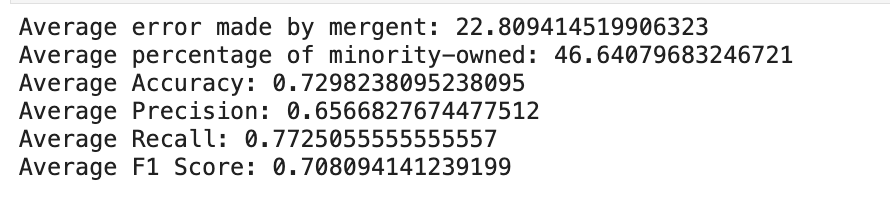

## Support Vector Machines
Support Vector Machine (SVM) is a powerful supervised machine learning algorithm used for classification and regression tasks. It belongs to the family of discriminative classifiers and works by finding the optimal hyperplane that maximizes the margin between different classes in the feature space. SVM is particularly effective when dealing with high-dimensional data, and it can handle both linearly separable and non-linearly separable datasets.

One of the key strengths of SVM lies in its ability to use different types of kernels to transform the data into higher-dimensional feature spaces, allowing it to learn complex decision boundaries. The most commonly used kernels are Linear Kernel, Polynomial Kernel, Radial Basis Function Kernel and Sigmoid Kernel.

In our analysis, we experimented with different SVM models, each employing a different kernel type. After careful evaluation of performance and classification of non-monority companies flagged by mergent, we found that the SVM model with a linear kernel and regularization parameter (C) set to 1 performed exceptionally well for our dataset. The linear SVM provided a decision boundary that effectively separated the classes in the feature space, and the regularization parameter helped to control overfitting, resulting in a more robust and accurate model for our classification task when compared with other kernels

# Performance of the Model

{width=80% }

We trained and evaluated SVM kernels with regularlization parameters C = {1, 0.1, 0.01} by randomly drawing samples and applying them the models to get the performance of each configuration. We repeated this process 10,000 times to make sure that our results were not by chance, and we found out the  Support Vector Machine model (linear kernel, C = 1) was 72% accurate. The final results are shown in the image below.